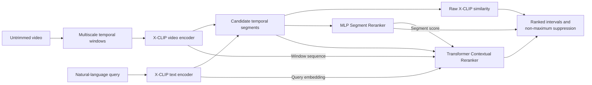

# Text-Guided Video Fragment Localization with Adapted X-CLIP Embeddings

Given an untrimmed video and a natural-language query, this project predicts the start and end timestamps of the matching event. It uses a frozen X-CLIP video-language encoder, multiscale temporal proposals, and lightweight learned rerankers trained on ActivityNet Captions.

The final Contextual Reranker improves Top-1 mean temporal IoU from **0.214 to 0.361** and Top-5 mean IoU from **0.396 to 0.561** over the raw X-CLIP baseline on 1,272 validation moments.

[Read the report](paper/report.pdf) · [Download X-CLIP](https://huggingface.co/microsoft/xclip-base-patch32)

## Architecture



X-CLIP remains frozen in all reported experiments. Training updates only the smaller scoring networks built on top of cached 512-dimensional video and text embeddings.

## Methods

### Raw X-CLIP

The baseline embeds overlapping video windows and the query into a shared space, scores them with cosine similarity, then applies smoothing, thresholding, segment merging, and non-maximum suppression.

### Segment Reranker

Adjacent X-CLIP windows are combined into candidate spans. An MLP scores each candidate using its pooled video embedding, the text embedding, their absolute difference and elementwise product, normalized temporal features, and X-CLIP similarity statistics.

### Contextual Reranker

A two-layer Transformer encoder with four attention heads contextualizes the full sequence of video windows. Candidate spans are pooled from these contextualized representations and reranked using temporal features and the Segment Reranker score.

## Dataset and experimental setup

The project uses [ActivityNet Captions](https://huggingface.co/datasets/friedrichor/ActivityNet_Captions). A small subset can be downloaded through FiftyOne and converted into the expected JSONL format:

```powershell
python download_fiftyone_subset.py `
  --max-samples 10 `
  --split validation `
  --caption-splits val1 `
  --video-root data\videos `
  --manifest-out data\activitynet_val.jsonl
```

Verify that every manifest entry resolves to a local video:

```powershell
python check_manifest_videos.py `
  --manifest data\activitynet_val.jsonl `
  --video-root data\videos
```

Each manifest row has this form:

```json
{"video_id":"v_example","video_path":"v_example.mp4","caption":"person cutting vegetables","start":12.5,"end":20.0}
```

Paths may be absolute or relative to `--video-root`. The download command above creates only a small example dataset; the reported experiments used separately prepared training and validation sets.

| Setting | Reported experiment |
|---|---|
| Training data | 6,807 captioned moments from 1,829 unique videos |
| Validation data | 1,272 captioned moments from 367 videos |
| Encoder | Frozen `microsoft/xclip-base-patch32` with 512-dimensional video and text embeddings |
| Temporal windows | 4, 8, 16, and 32 seconds |
| Window strides | 2, 2, 4, and 8 seconds during training; 1, 2, 4, and 8 seconds during evaluation |
| Video sampling | 8 frames per clip |
| Learned models | MLP Segment Reranker and two-layer, four-head Transformer Contextual Reranker |
| Training target | Temporal IoU between each candidate interval and its annotated interval |
| Evaluation | Top-1 through Top-5 mean IoU and recall at IoU thresholds 0.1, 0.5, and 0.7 |

Video decoding and X-CLIP embedding generation were performed before reranker training, and the embeddings were cached for reuse. The final Segment and Contextual Reranker checkpoints are provided in `checkpoints/`.

## Results

The models were evaluated on 1,272 captioned moments from 367 ActivityNet Captions validation videos.

| Method | Top-k | mIoU | R@0.1 | R@0.5 | R@0.7 |
|---|---:|---:|---:|---:|---:|
| Raw X-CLIP | 1 | 0.214 | 0.494 | 0.171 | 0.075 |
| Raw X-CLIP | 2 | 0.303 | 0.667 | 0.260 | 0.114 |
| Raw X-CLIP | 3 | 0.353 | 0.760 | 0.314 | 0.141 |
| Raw X-CLIP | 4 | 0.380 | 0.809 | 0.342 | 0.151 |
| Raw X-CLIP | 5 | 0.396 | 0.829 | 0.367 | 0.161 |
| Segment Reranker | 1 | 0.354 | 0.743 | 0.314 | 0.149 |
| Segment Reranker | 2 | 0.446 | 0.816 | 0.457 | 0.245 |
| Segment Reranker | 3 | 0.494 | 0.848 | 0.537 | 0.305 |
| Segment Reranker | 4 | 0.527 | 0.872 | 0.593 | 0.347 |
| Segment Reranker | 5 | 0.551 | 0.888 | 0.631 | 0.386 |
| Contextual Reranker | 1 | 0.361 | 0.745 | 0.324 | 0.156 |
| Contextual Reranker | 2 | 0.450 | 0.825 | 0.454 | 0.242 |
| Contextual Reranker | 3 | 0.503 | 0.861 | 0.545 | 0.314 |
| Contextual Reranker | 4 | 0.540 | 0.883 | 0.613 | 0.366 |
| Contextual Reranker | 5 | **0.561** | **0.902** | **0.649** | **0.390** |

For each query, mIoU is the mean best temporal intersection-over-union among the first `k` predictions. R@0.1, R@0.5, and R@0.7 are the proportions of queries for which at least one of those predictions reaches the stated IoU threshold. Top-1 represents the single final prediction; larger `k` values help distinguish proposal-generation errors from ranking errors. Exact machine-readable values are available in [`results/metrics.json`](results/metrics.json).

## Installation

Python 3.11 was used for development; Python 3.10 or newer is required.

```powershell
python -m venv .venv
.\.venv\Scripts\Activate.ps1
python -m pip install --upgrade pip
python -m pip install -r requirements.txt
```

Download the X-CLIP model before inference or training:

```powershell
python video_clip_cli.py download-model
```

The model loader intentionally uses the local Hugging Face cache after this step.

## Quick single-video inference

Both supported commands accept any locally stored, decodable video and a natural-language query. 

### Raw X-CLIP baseline

Run the pretrained baseline without a project-specific checkpoint:

```powershell
python video_clip_cli.py explain `
  --video path\to\video.mp4 `
  --query "person cutting vegetables" `
  --top-k 3 `
  --device cuda
```

### Contextual Reranker

Run the best-performing model. All required trained weights are included and loaded automatically:

```powershell
python video_clip_cli.py context-explain `
  --video path\to\video.mp4 `
  --query "person cutting vegetables" `
  --device cuda
```

The command prints JSON containing the number of scored candidates and the ranked intervals remaining after non-maximum suppression:

```json
{
  "query": "person cutting vegetables",
  "video_path": "path\\to\\video.mp4",
  "candidates_scored": 1234,
  "final_segments": [
    {"start": 12.0, "end": 22.0, "score": 0.61}
  ]
}
```

The numbers above illustrate the output structure; predictions depend on the supplied video.

## Limitations

- Because of limited disk space, GPU capacity, and video-processing time, the models were trained on 1,829 of the 10,009 videos in the official ActivityNet Captions training split and evaluated on 367 validation videos. Using more of the training split would expose the rerankers to a wider variety of actions, video conditions, and temporal patterns and could improve their generalization and results, although an improvement is not guaranteed without further experiments.
- Results are below dedicated temporal-grounding architectures such as 2D-TAN, Moment-DETR, and QD-DETR. Those systems are designed specifically for temporal localization and typically require prepared visual feature files, task-specific model implementations, and larger training setups; this project instead uses a frozen general-purpose X-CLIP encoder with lightweight rerankers.
- Top-5 performance is substantially stronger than Top-1, indicating that ranking the correct proposal first remains difficult.
- Predicted start and end times can be imprecise for short actions or events with visually subtle boundaries. X-CLIP is frozen, and candidate intervals are constructed from sampled, fixed-length video windows rather than predicted frame by frame.
- ActivityNet Captions references externally hosted videos instead of distributing the video files. Some links may later be removed or become inaccessible, so future users may be unable to obtain exactly the same validation videos.
